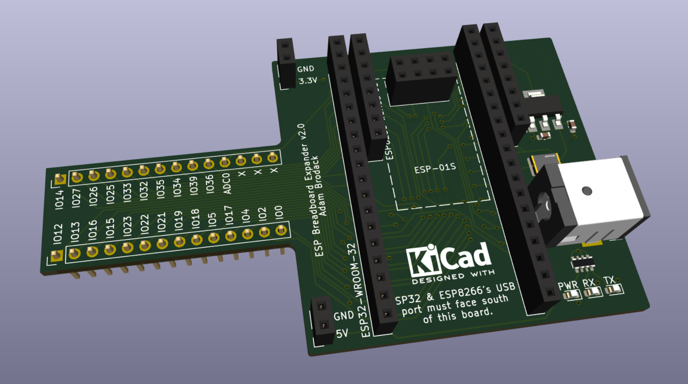
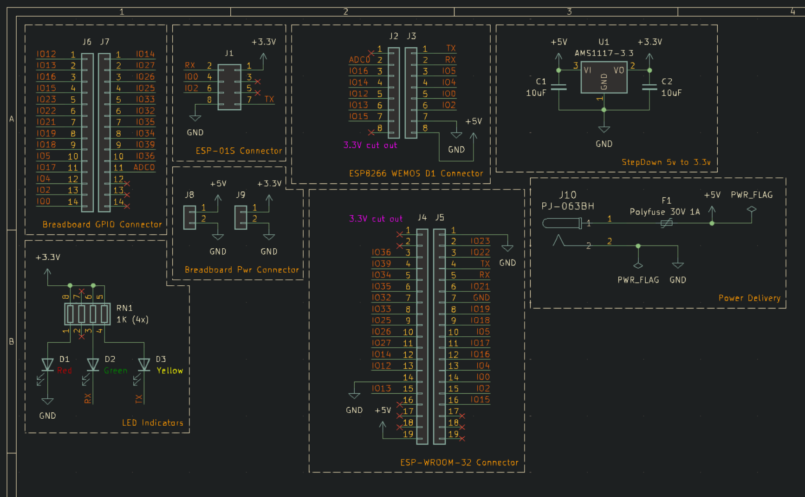

# ESP Breadboard Expander

Kicad-designed ESP32/ESP8266/ESP-01S breadboard expander PCB with built-in external power supply. This is to provide the option for connecting these ESP chips to the standard breadboards with a separate power supply to provide enough current for prototyping. This DC power supply also powers the ESP chip too.

Orders were done with JLCPCB and the generated files for order is found under [jlcpcb/production_files/](jlcpcb/production_files/).

This PCB was designed as my first project to understand the whole designing process as well as the JLCPCB ordering part. It has gone through 2 revisions to get it working properly.

## Specifications

* It uses a 5V DC (5.5 x 2.5mm) power supply to power the board, can use an AC to DC power supply or USB to DC jack cable to power this PCB board.
* Uses a specific ESP32 chip (ESP-WROOM-32; [Amazon Link](https://www.amazon.com/gp/product/B0B764YL3J)) to fit on this board. Other variations would most likely not fit the ESP32 slot.

## Schematic

